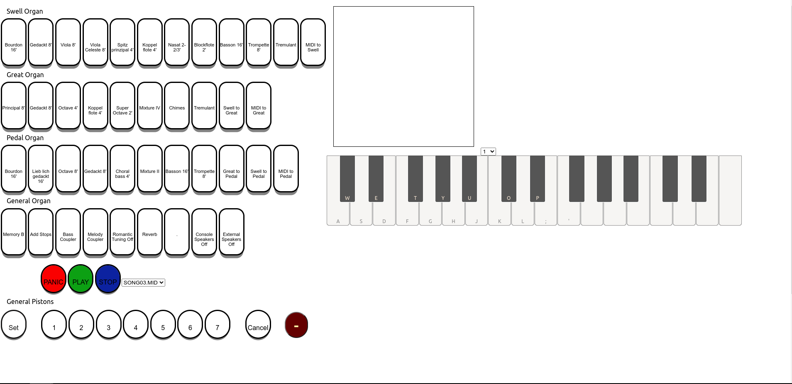

# wfh-organist [](https://goreportcard.com/report/github.com/jrcichra/wfh-organist) [](https://github.com/jrcichra/wfh-organist/actions/workflows/go.yml) [](https://github.com/jrcichra/wfh-organist/actions/workflows/react.yml)

<p align="center">


</p>

Be a Work-From-Home Organist. Written in Go. Send MIDI over regular TCP/IP to your local church.

# Introduction

This program listens to MIDI input and sends the notes over TCP. The program used in server or client mode, or both at the same time. This leads to some interesting use cases:

- Remote control a MIDI keyboard over the LAN
- Remote control a MIDI keyboard over the Internet
- Test modifications to `server.go` or `client.go` locally knowning it would work the same on the LAN or the Internet, because the program goes through the IP stack regardless of what mode
- Conditionally modify MIDI channels in `client.go` to work with the organ attached on the other end

# Build notes

I used Go 1.17 for this project, but older versions will probably work. There are external cgo dependencies so you'll need a few packages from your distro's package manager. This also means I can't easily provide cross-architecture targets.

# Server Install

- Download a recent version of [Go](https://go.dev/dl/), [node](https://nodejs.org/en/), and [yarn](https://yarnpkg.com/) for your operating system. Replace `VITE_VIDEO_URL` with the URL of an mjpeg stream at the church (if configured).
- `git clone https://github.com/jrcichra/wfh-organist.git`
- `go build`
- `cd gui`
- `yarn install && VITE_VIDEO_URL=http://localhost:8080/video yarn build`
- `./wfh-organist -help`

I've included a sample systemd service for the server.

WFHO will serve static HTTP content under `gui/dist`, where it should have compiled the Vite app.

Organs are configurable through the `profiles` directory. `channels.csv` is a CSV file which translates messages on the client-side before sending them over the network. This allows your home organ's MIDI channels to be mapped to a church's MIDI channels or transposed. When remotely playing at different churches, different profiles can be selected client-side with the `-profile` flag.

`stops.yaml` defines the stop groups shown on the website and byte sequences for each stop. By sniffing the MIDI output of the organ, you can build a list of virtual stops. The example set of stops is for an [Allen Organ MDS-1](https://www.allenorgan.com/support/ownersmanuals/033-0050.pdf).

The `default` profile makes no modification to the MIDI notes.

# Client Install

- Same steps as above, except node and yarn are not required. Only `go build` and run the binary.
- The client does support listening to an expression pedal sending messages over a serial port. Currently this is not configurable.

An expression pedal can be used over serial. Just specify the TTY and baud rate. Currently the intensity is non-configurable, but you can modify `expressionPercentage` in `internal/serial.go`.

```
Usage of ./wfh-organist:
  -delay int
        artificial delay in ms
  -list
        list available ports
  -midi int
        midi port (default 1)
  -mode string
        client, server, or local (runs both) (default "local")
  -norecord
        continuously record midi
  -novolume
        have WFHO control client volume
  -port int
        server port (default 3131)
  -profile string
        profiles path (default "profiles/wosp/")
  -protocol string
        tcp only (udp not implemented yet) (default "tcp")
  -serialBaud int
        serial port baud rate (default 115200)
  -serialPath string
        serial port path
  -server string
        server IP (default "localhost")
  -stdin
        read from stdin
```

# Web GUI

The web server is accessible on port `8080`. Through the GUI, stops from `stops.yaml` will appear. General pistons are currently hard-coded for the MDS-1. MIDI files located in `./midi` on the server will be available to play. The red PANIC button will stop any stuck notes. The on-screen keyboard will send notes to the channel in the drop-down. 

# Recording

WFHO is set to always record on the MIDI-IN port from your USB to MIDI adapter. It will separate recordings based on a small timeout. It saves the midi files with as `$EPOCH.mid`

# Design choices

- TCP - This program was implimented with TCP but could also use UDP. I chose TCP to avoid 'stuck notes' in the event a NoteOff packet was dropped. TCP has the downside of effectively 'losing notes'. When a lag spike hits, the TCP stream will catch up and all the MIDI events will happen as fast as possible. This leads to gaps because the NoteOn and NoteOff happen almost instantaneously. TCP over the Internet in 2022 has been stable enough where real-time MIDI protocols haven't been a priority for the project.
- Single Binary - Instead of managing two binaries, "server/client", I combined them into a single binary. I felt the space increase was worth the flexability and simplicity of managing one binary. The mode is controlled with a single flag. There was also a lot of shared code between the server and client, so making it a single binary was easy.

# Recommended Applications

- I'm using Tailscale to simplify the connection process. Both the server and client can be behind NATs and moved between churches without having to configure anything.
- I'm also using [trx](http://www.pogo.org.uk/~mark/trx/) over the Tailscale connection for two-way audio. Since it's sending unencrypted audio streams it's a little easier to deal with inside a VPN.
- For video, I'm using [motion](https://motion-project.github.io/) with a low framerate on a Raspberry Pi.

# Testing

This program was tested under a variety of real-world latency conditions, all with minimal packet loss. Your mileage may vary.

- Local mode - `0-1ms` delay
- Starlink -> Cloudflare EWR -> Starlink - `30-40ms` delay - `Great experience`
- Starlink -> Oracle Ashburn -> Starlink - `30-40ms` delay - `Great experience`
- Starlink -> Linode Canada -> Starlink - `50-70ms` delay - `Good experience`
- T-Mobile IoT -> Oracle Ashburn -> T-Mobile IoT - `100-170ms` delay - `Tolerable experience`
